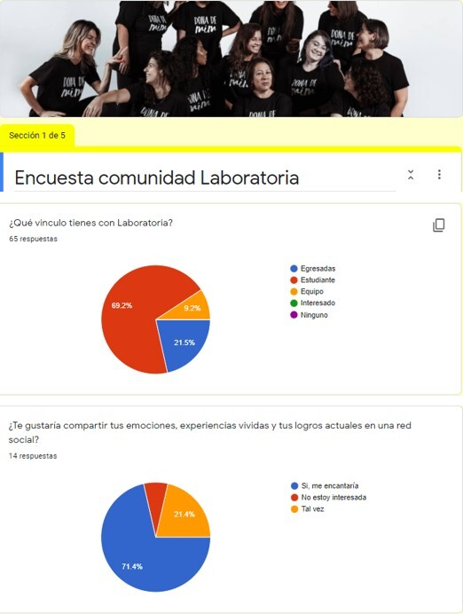
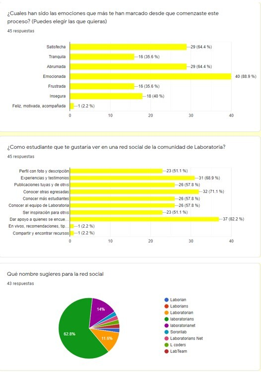
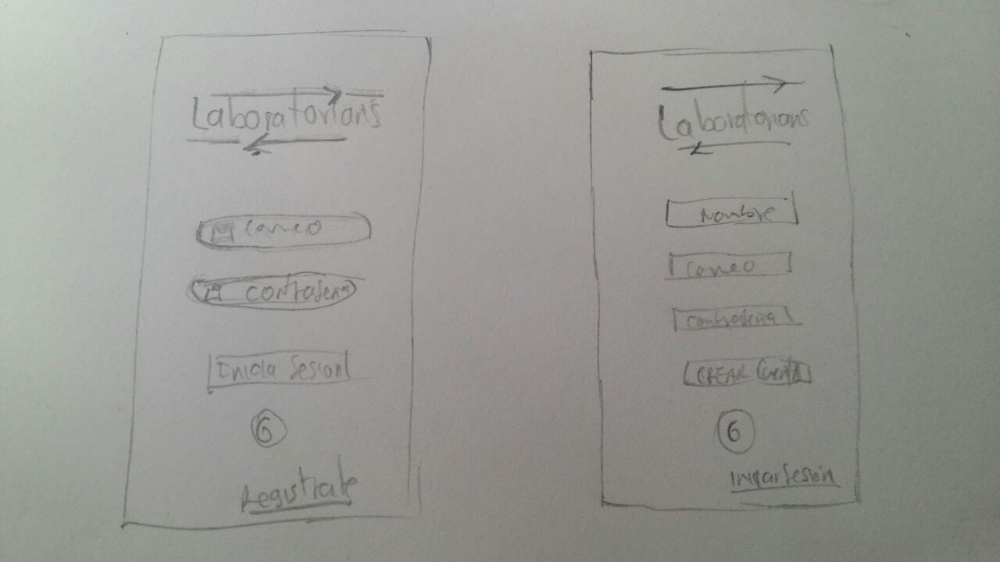
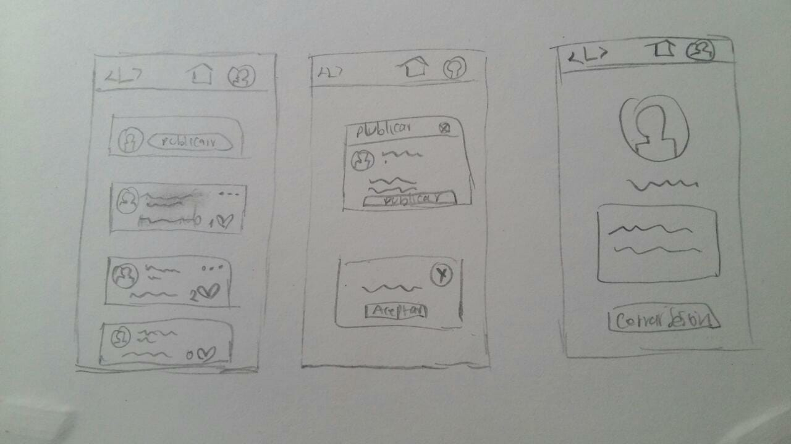
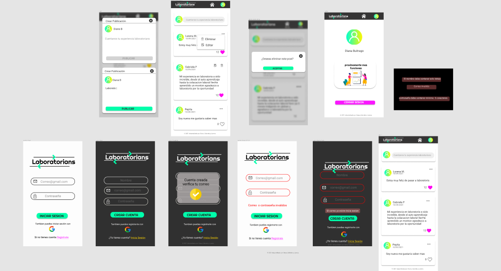
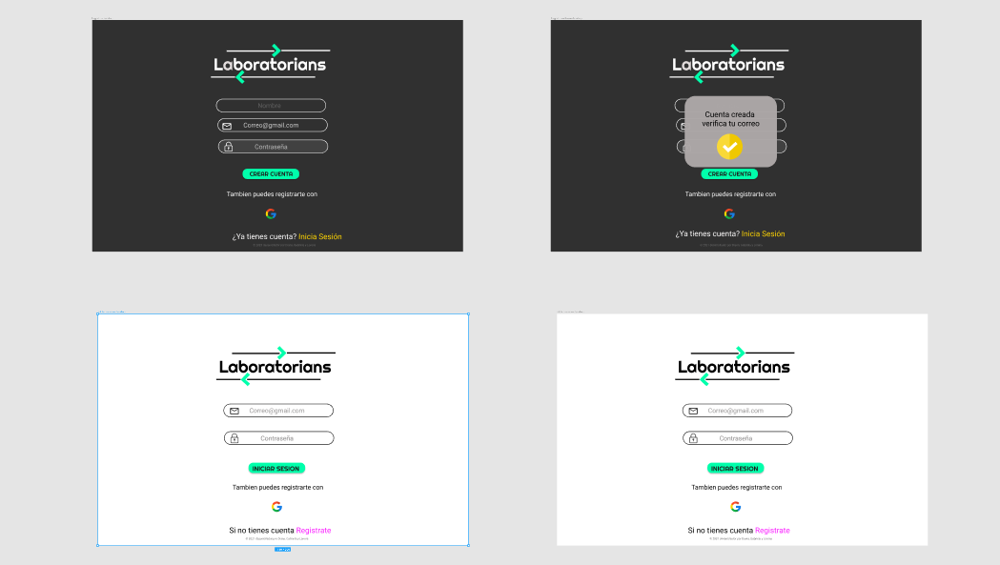
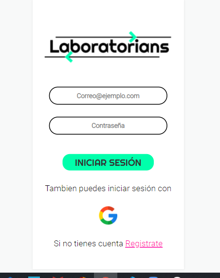
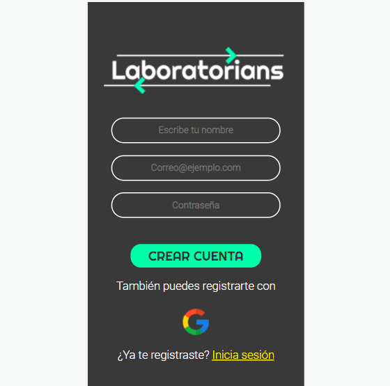
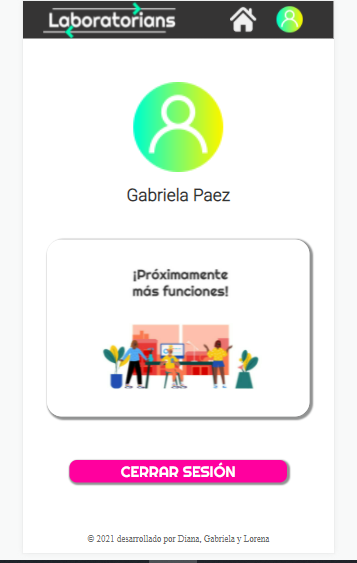
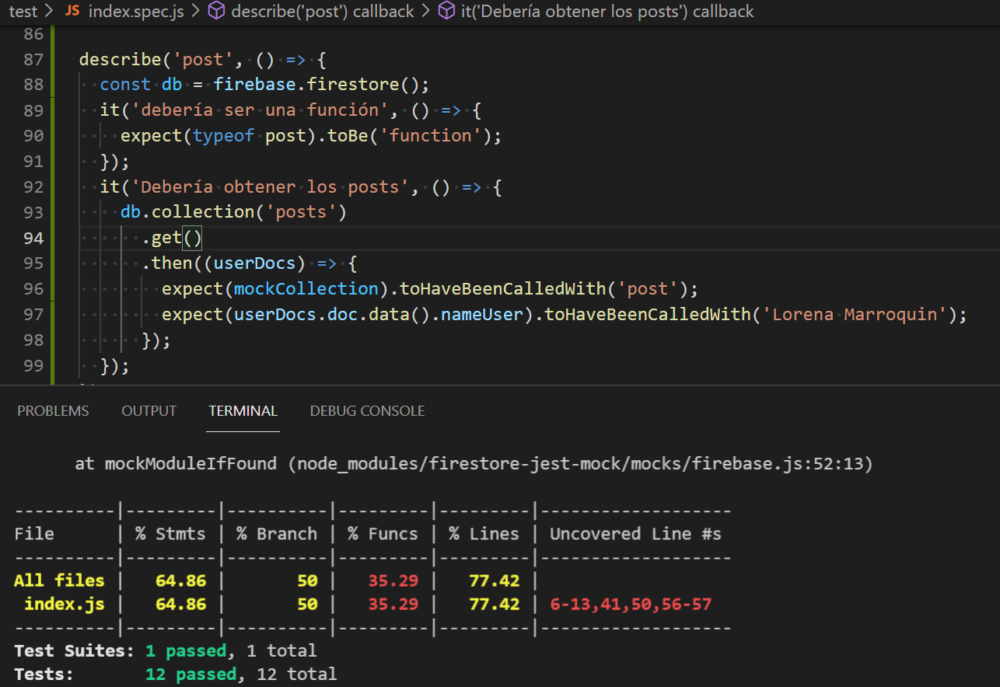

# Red Social Laboratorians 
#### Desarrollado por Gabriela Paez, Diana Buitrago y Lorena Marroquin

## Índice

* [1. Definición del Producto](#1-Definición del Producto)
* [2. Investigacion UX](#2-Investigacion UX)
* [3. Historias de usuario](#3-Historias de usuario)
* [4. Protipos de baja y alta fidelidad](#4-Protipos de baja y alta fidelidad)
* [5. Comportamiento UI](#5-Comportamiento UI)
* [6. Producto final](#6-Producto final)
* [7. Test Unitario](#7-Test Unitario)
* [8. Objetivos de aprendizaje](#8-Objetivos de aprendizaje)

## 1. Definición del Producto

Laboratorian es una red social dirigida a egresadas, estudiantes, equipo e interesadxs de la experiencia que ofrece el bootcamp, con el fin de que lxs usuarixs puedan compartir sus experiencias relacionadas con Laboratoria.

#### Quiénes son los principales usuarios de producto
Estudiantes, Egresadas, integrantes  del equipo y personas interesadas de la experiencia que ofrece Laboratoria.

#### Qué problema resuelve el producto
Promueve el fortalecimiento de la comunidad, integra a quienes se interesan por la experiencia en Laboratoria, motiva e inspira a quienes inician en el proceso por medio de las experiencias compartidas.

## 2. Investigacion UX

Realizamos investigacion UX a traves de una encuesta para conocer  nuestro usuarios

#### Hallazgos

* Los principales usuarios son: Estudiantes y egresadas
* El nombre mas botado fue Laboratorians 
* Los usuarios quieren compartir sus experiencias y da apoyo

## 3. Historias de usuario

* **HU 1:** Yo como usuarix sin registro a la red social Laboratorians quiero crear una cuenta para acceder identificadx con nombre, correo electronico y contraseña.

* **HU 2:** Yo como usuarix  registradx a la red social Laboratorians quiero acceder con mi  cuenta  o autenticado con Google para acceder al contenido de Laboratorians.

* **HU 3:** Yo como usuarix que inicie sesión en la red social Laboratorians quiero ver un muro donde pueda publicar para compartir experiencias vividas relacionadas con Laboratoria.

* **HU 4:** Yo como usuarix registrado y logueado en la red social Laboratorians quiero ver una sección de mi perfil donde pueda ver mi nombre y cerrar sesión.

## 4. Protipos de baja y alta fidelidad

#### Prototipo baja fidelidad mobile

#### Prototipo alta fidelidad mobile

#### Prototipo alta fidelidad desktop

#### Figma
[Prototipo Figma](https://www.figma.com/file/N640coMwcQeN7Y4lYQo5i6/Social-Network-%3CL%3E?node-id=0%3A1)

## 5. Comportamiento UI

#### Creación de cuenta de usuario e inicio de sesión
* Login con Firebase:
 - Login para ingreso.
 - Creación de cuenta de acceso y autenticación con cuenta de correo y contraseña, y también con una cuenta de Google.
  
* Validaciones:
 - Solamente se permite el acceso a usuarios con cuentas válidas.
 - No pueden haber usuarios repetidos.
 - La cuenta de usuario debe ser un correo electrónico válido.
 - Lo que se escriba en el campo (input) de contraseña debe ser secreto con un minimo de caracteres.

* Comportamiento:
- Cuando envia el formulario de registro o inicio de sesión, se valida.
- Si hay errores, se muestran mensajes descriptivos para ayudar al usuario a corregirlos.

#### Muro
* Validaciones:
- Al publicar, se valida que exista contenido en el input.

* Comportamiento:
- Al recargar la aplicación, se verifica que el usuario este logueado antes de mostrar contenido.
- Se puede publicar un post en tiempo real.
- Se puede dar y quitar like a una publicación. Máximo uno por usuario.
- Se lleva un conteo de los likes.
- Se puede eliminar un post específico.
- Se pide confirmación antes de eliminar un post.
- Al dar click para editar un post, se puede cambiar el texto por un input que permita editar el texto y luego guardar los cambios.
- Al guardar los cambios se puede cambiar de vuelta a un texto normal pero con la información editada.
- Al recargar la página se puede ver los textos editados.

#### Profile
* Comportamiento:
- Se puede cerrar sesion.
- Puede visualizar el nombre de usuario
  

## 6. Producto final

## 7. Test Unitario

## 8. Objetivos de aprendizaje

* [x] UX y UI.
* [x] HTML5 y CSS3.
* [x] Dom
* [x] Javascript Vanilla
* [x] Git Hub y Git Pages
* [x] eslint y jest
* [x] Firebase y firestore
* [x] mocks

